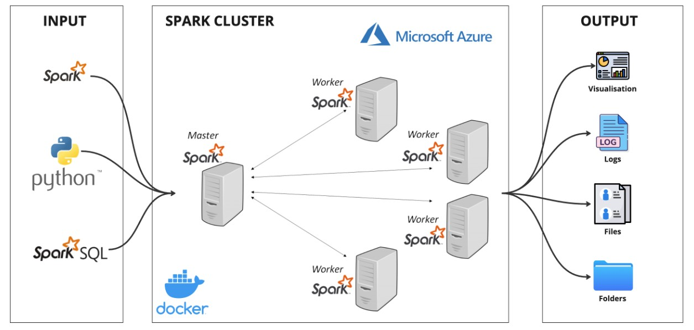
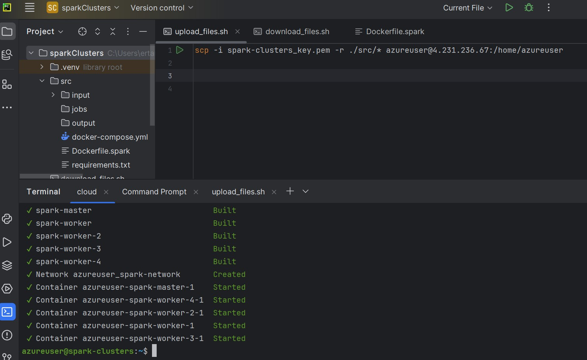
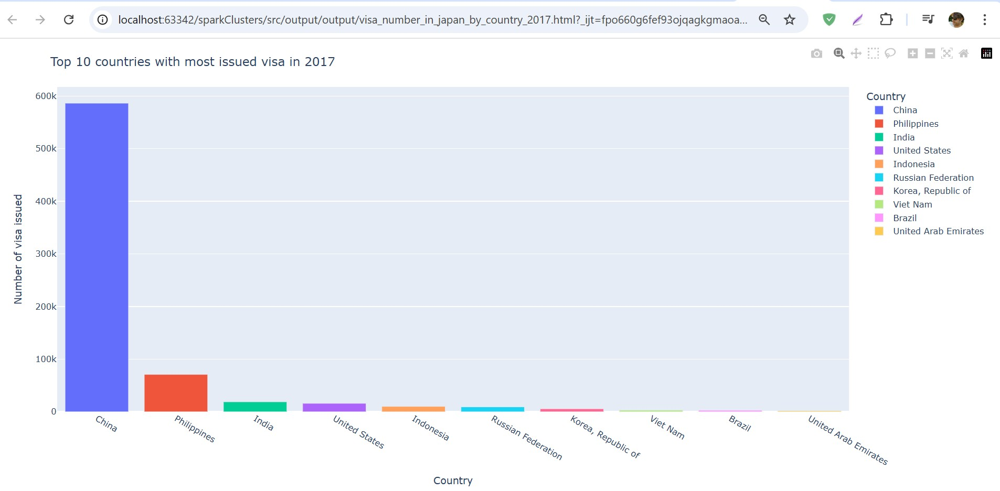
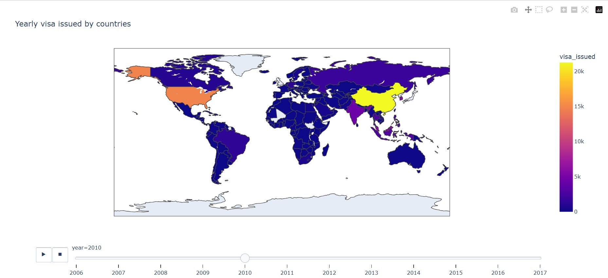

# Japan_Visa_Analyses__Data-Engineering_Project
 This project sets up an Apache Spark cluster using Docker and processes visa issuance data for Japan. The analysis cleans and visualizes the data using PySpark and Plotly.

## <ins>Setup & Requirements</ins>

 1. <b>Azure Account:</b> Ensure you have an active Azure account.
 2. <b>Docker:</b> The Spark master-worker architecture is set up in a Docker container on Azure.
 3. <b>Python Libraries:</b> Install the required Python libraries:
     - PySpark
     - Plotly Express
     - pycountry
     - pycountry_convert
     - fuzzywuzzy

 ## <ins>System Architecture</ins>
  <p></p>

## <ins>Features</ins>
    
 - <b>Spark Cluster Deployment:</b> Uses Docker Compose to set up a Spark Master and multiple Spark Workers.
 - <b>Data Processing:</b> Cleans and processes visa issuance data from CSV files.
 - <b>Data Cleaning:</b> The script standardizes column names, drops null columns, and corrects country names using fuzzy matching.
 - <b>Data Transformation:</b> The data is further enriched by adding continent information for each country.
 - <b>Visualization:</b> Generates interactive charts using Plotly and saves them as HTML files.

## <ins>Project Structure</ins>
```sh
|-- src/
    |-- jobs/
        |-- visualisation.py  # Main Spark job script
    |-- input/  # Input data files
    |-- output/  # Processed output and visualizations
    |-- docker-compose.yml  # Docker Compose configuration
    |-- Dockerfile.spark  # Custom Spark image configuration
    |-- requirements.txt  # Python dependencies
    |-- upload_files.sh  # Script to upload files to Azure VM
    |-- download_files.sh  # Script to download results from Azure VM
```

## <ins>Prerequisites</ins>
- Docker & Docker Compose
- Python 3
- An Azure Virtual Machine (for deployment)
- SSH key for remote access
- Download dataset of Japan visa csv file: https://www.kaggle.com/datasets/yutodennou/visa-issuance-by-nationality-and-region-in-japan 

## Setup and Deployment
### 1. **Clone the Repository**
```sh
git clone <repository_url>
cd <repository_folder>
```
### 2. **Create and connect to Azure VM**
Once the cluster is running, you can access the Spark Web UI:
- Move ssh key to project folder using "scp" cmd 
- chmod 400 spark-clusters_key.pem
```sh
ssh -X azureuser@<your-azure-vm-ip> -i spark-clusters_key.pem
```
### 3. **Upload Files to Azure VM**
```sh
./upload_files.sh
```
<b>Note:</b> Do not forget to upload! When you have installed any packages or after applying changes to your code.
### 4. **Build and Start the Spark Cluster**
```sh
sudo docker-compose up -d --build
```
### 5. **Run the Data Processing Job**
```sh
sudo docker exec -it <spark-worker-container-name> spark-submit
```
### 6. **Download Processed Output from VM**
```sh
chmod +x download_files.sh
./download_files.sh
```
## Accessing Spark UI

 Add inbound security rule to see spark master web ui on port 9090
 <p></p>
 Once the cluster is running, you can access the Spark Web UI:
    - Spark Master: http://<your-azure-vm-ip>:9090
 <p></p>

## Results

The processed data and visualizations are saved in the output/ directory, including:
    - Visa issuance trends by continent
     <p></p>
    - Top 10 countries in 2017
     <p></p>
    - Yearly Visa issuance world map
     <p></p>
    

